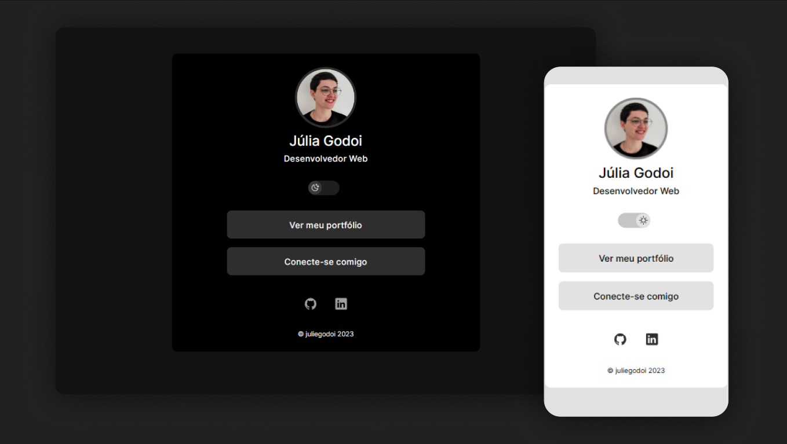

<h1 align="center"> DevLinks </h1>

 

  

## 🚀 Tecnologias

Esse projeto foi desenvolvido junto ao <strong>Discover</strong> da <strong>Rocketseat</strong> com as seguintes tecnologias:

- HTML e CSS
- JavaScript
- Git e Github

## 💻 Projeto

O DevLinks é um agregador de links para usar como cartão de visitas online.

- [Acesse o projeto finalizado aqui](https://juliegodoi.github.io/DevLinks/)